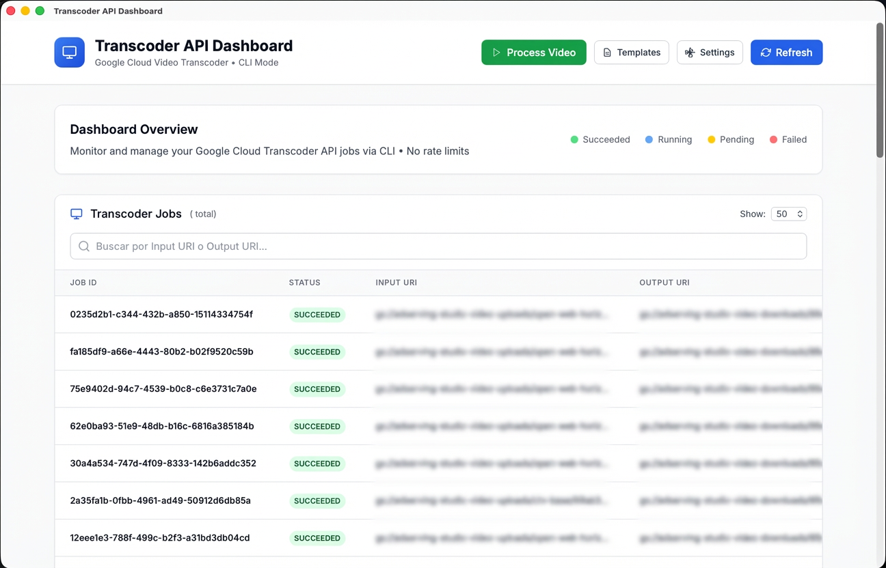
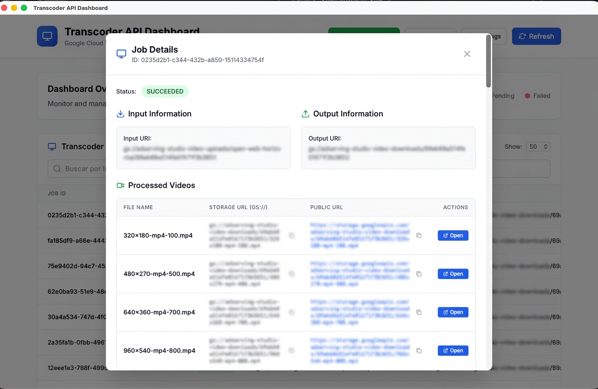
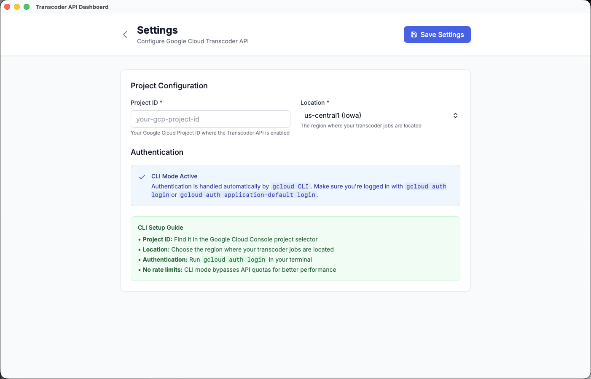

# Transcoder App

A desktop UI for teams that use Google Cloud Video Transcoder but do not want to live in the CLI all day.

This app wraps the `gcloud` Transcoder workflow in a focused Tauri desktop experience: browse jobs, inspect outputs, launch new transcodes, manage templates, and keep project/location settings local to your machine.

## Why This App Exists

Google Cloud Transcoder is powerful, but the day-to-day operator workflow is usually fragmented:

- create jobs in the CLI
- inspect results in raw JSON
- jump between bucket paths and output URLs
- manage templates by hand

Transcoder App turns that into one desktop workflow.

## What You Can Do

- Browse jobs with pagination and URI search
- Open a full job detail view with status, timing, input, output, and generated files
- Copy `gs://` and public output URLs directly from the UI
- Launch new jobs using built-in presets or custom Google Cloud templates
- Manage custom templates from the desktop app
- Keep Google Cloud project and location settings persisted locally
- Work through your existing `gcloud` authentication instead of embedding service-account secrets

## Product Snapshot

The current app includes four main areas:

1. Dashboard: recent jobs, status overview, search, and pagination
2. Job details: output inventory, URLs, timestamps, and raw request/debug views
3. Process Video: create a new job from a GCS input and output path
4. Templates and Settings: manage reusable transcoding configs and local app connection settings

## Screenshots

### Dashboard



### Job Details



### Settings



## Supported Specs

The app supports two categories of transcoding specs:

- Built-in job presets exposed directly in the UI:
  - `preset/web-hd`
  - `preset/web-sd`
- Custom Google Cloud Transcoder job templates entered as JSON and passed through to `gcloud`

Human-readable specs live in [docs/specs/index.md](docs/specs/index.md).

## Architecture

- [src/](src): Rust domain logic, config storage, and `gcloud` integration
- [src-tauri/](src-tauri): Tauri desktop shell
- [ui/](ui): SolidJS frontend

The app does not talk to Google Cloud directly with embedded SDK credentials. It shells out to `gcloud`, which means:

- your local auth flow stays standard
- there are no service-account keys stored in this repo
- behavior stays close to the CLI operators already know

## Requirements

- Rust stable
- Node.js 20+
- npm 10+
- `gcloud` CLI on `PATH`
- an authenticated Google Cloud session with access to Transcoder API

## Authentication

Authentication is delegated to the local Google Cloud CLI session.

Examples:

```bash
gcloud auth login
gcloud auth application-default login
```

## Local Development

Install frontend dependencies:

```bash
npm --prefix ui install
```

Run the desktop app:

```bash
cargo tauri dev --manifest-path src-tauri/Cargo.toml
```

Build the frontend:

```bash
npm --prefix ui run build
```

Build the desktop app:

```bash
cargo tauri build --manifest-path src-tauri/Cargo.toml
```

## Testing

Rust tests:

```bash
cargo test
```

Frontend tests:

```bash
npm --prefix ui run test
```

## Configuration

Settings are stored in the native user config directory under `gcloud-transcoder-app/config.json`.

Shape:

```json
{
  "version": 1,
  "googleCloud": {
    "projectId": "",
    "location": "us-central1"
  }
}
```

Behavior:

- missing config creates defaults
- corrupt config is backed up and recreated
- older config versions are migrated with a backup

More detail: [docs/specs/app-configuration.md](docs/specs/app-configuration.md)

## Documentation Map

- [docs/specs/index.md](docs/specs/index.md)
- [docs/specs/built-in-presets.md](docs/specs/built-in-presets.md)
- [docs/specs/template-json-support.md](docs/specs/template-json-support.md)
- [docs/specs/job-observability.md](docs/specs/job-observability.md)
- [docs/specs/app-configuration.md](docs/specs/app-configuration.md)
- [docs/specs/limitations-and-behavior.md](docs/specs/limitations-and-behavior.md)

## License

MIT. See [LICENSE](LICENSE).
